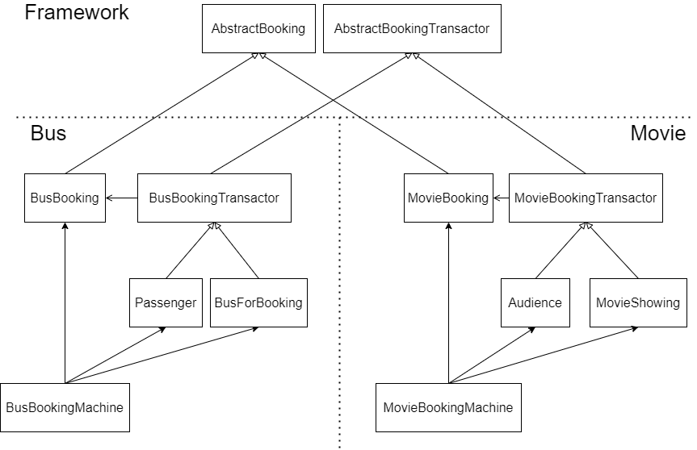

# Object-Oriented Software Engineering hw4

+ Author: 黃柏瑄 (P78081528)

## Environment

+ OS: Ubuntu18.04.5 (WSL2)
+ C++ compiler: g++ (Ubuntu 8.4.0-1ubuntu1~18.04) 8.4.0

## Source code

### Simple UML



### File architecture

```txt
$ tree . -I 'bin|*.md'
.
├── Makefile
└── src/
    ├── booking_framework/
    │   ├── abstract_booking.h
    │   └── abstract_booking_transactor.h
    ├── bus_booking_system/
    │   ├── Makefile
    │   ├── bus_booking.cc
    │   ├── bus_booking.h
    │   ├── bus_booking_machine.cc
    │   ├── bus_booking_machine.h
    │   ├── bus_booking_transactor.cc
    │   ├── bus_booking_transactor.h
    │   ├── bus_for_booking.cc
    │   ├── bus_for_booking.h
    │   ├── date.cc
    │   ├── date.h
    │   ├── main.cc
    │   ├── passenger.cc
    │   └── passenger.h
    └── movie_booking_system/
        ├── Makefile
        ├── audience.cc
        ├── audience.h
        ├── date.cc
        ├── date.h
        ├── main.cc
        ├── movie_booking.cc
        ├── movie_booking.h
        ├── movie_booking_machine.cc
        ├── movie_booking_machine.h
        ├── movie_booking_transactor.cc
        ├── movie_booking_transactor.h
        ├── movie_showing.cc
        └── movie_showing.h

4 directories, 31 files
```

+ File `src/booking_framework/abstract_booking.h`:

  ```c++
  #ifndef ABSTRACT_BOOKING
  #define ABSTRACT_BOOKING
  
  /**
   * @brief Abstract class for Booking.
   *
   * Any concrete booking should be derived from this class.
   */
  class AbstractBooking {};
  
  #endif /* ABSTRACT_BOOKING */
  ```

+ File `src/booking_framework/abstract_booking_transactor.h`:

  ```c++
  #ifndef ABSTRACT_BOOKING_TRANSACTOR_H
  #define ABSTRACT_BOOKING_TRANSACTOR_H
  
  #include <memory>
  #include <unordered_map>
  #include "abstract_booking.h"
  
  /**
   * @brief Abstract class of booking transactor.
   *
   * @tparam Booking the class name that used to be transacted.
   */
  template <typename Booking>
  class AbstractBookingTransactor {
   public:
    AbstractBookingTransactor() {
      static_assert(
          std::is_base_of<AbstractBooking, Booking>::value,
          "Your customed Booking should be derived from AbstractBooking.");
    }
    /**
     * @brief Add the booking into held booking list.
     *
     * @param booking_index the unique index.
     * @param booking the shared pointer to the booking object.
     */
    void AddBookingTransaction(int booking_index,
                               std::shared_ptr<Booking> booking) {
      held_bookings_.emplace(booking_index, booking);
      this->BookingAdded(booking);
    }
  
    /**
     * @brief Remove a booking from the booking list.
     *
     * @param booking_index the index of the booking to be removed.
     */
    void RemoveBookingTransaction(int booking_index) {
      auto erase_count = held_bookings_.erase(booking_index);
  
      if (erase_count == 0) {
        this->BookingEmptyWhenRemoved();
      }
      this->BookingRemoved();
    }
  
    std::unordered_map<int, std::shared_ptr<Booking>> get_held_bookings() const {
      return held_bookings_;
    }
  
    /* Hooks */
    /**
     * @brief The hook called when a Booking is added.
     *
     * Derived class can override this hook function.
     */
    virtual void BookingAdded(std::shared_ptr<Booking>) {}
  
    /**
     * @brief The hook called when a Booking is removed.
     *
     * Derived class can override this hook function.
     */
    virtual void BookingRemoved() {}
  
    /**
     * @brief The hook called when the held booking is empty during calling
     * RemoveBookingTransaction.
     *
     * Derived class can override this hook function.
     */
    virtual void BookingEmptyWhenRemoved() {}
  
   protected:
    std::unordered_map<int, std::shared_ptr<Booking>> held_bookings_;
  };
  
  #endif /* ABSTRACT_BOOKING_TRANSACTOR_H */
  ```

+ File `src/bus_booking_system/bus_booking.h`:
  ```c++
  #ifndef BUS_BOOKING_H
#define BUS_BOOKING_H
  
  #include <string>
  #include "../booking_framework/abstract_booking.h"
  #include "date.h"
  
  class BusBooking : public AbstractBooking {
   public:
    BusBooking(std::string buyer_name, std::string bus_name, int num_of_people,
               Date bus_departure_date);
    std::string get_buyer_name() const;
    std::string get_bus_name() const;
    int get_num_of_people() const;
    Date get_bus_departure_date() const;
  
   private:
    std::string buyer_name_{""};
    std::string bus_name_{""};
    int num_of_people_{0};
    Date bus_departure_date_{1997, 1, 1};
  };
  
  std::ostream &operator<<(std::ostream &out, const BusBooking bus_booking);
  
  #endif /* BUS_BOOKING_H */
  ```
  
+ File `src/bus_booking_system/bus_booking.cc`:
  ```c++
  #include "bus_booking.h"

  BusBooking::BusBooking(std::string buyer_name, std::string bus_name,
                         int num_of_people, Date bus_departure_date)
      : buyer_name_{buyer_name},
        bus_name_{bus_name},
        num_of_people_{num_of_people},
        bus_departure_date_{bus_departure_date} {}
  
  std::string BusBooking::get_buyer_name() const { return buyer_name_; }
  std::string BusBooking::get_bus_name() const { return bus_name_; }
  int BusBooking::get_num_of_people() const { return num_of_people_; }
  Date BusBooking::get_bus_departure_date() const { return bus_departure_date_; }
  
  std::ostream &operator<<(std::ostream &out, const BusBooking bus_booking) {
    out << "Passenger: " << bus_booking.get_buyer_name()
        << ", Bus: " << bus_booking.get_bus_name()
        << ", Num of people: " << bus_booking.get_num_of_people()
        << ", Date: " << bus_booking.get_bus_departure_date();
    return out;
  }
  ```
  
+ File `src/bus_booking_system/bus_booking_machine.h`:
  ```c++
  #ifndef BUS_BOOKING_MACHINE_H
#define BUS_BOOKING_MACHINE_H
  
  #include "bus_booking.h"
  #include "bus_for_booking.h"
  #include "passenger.h"
  
  class BusBookingMachine {
   public:
    /**
     * @brief Get the Booking Machine object.
     *
     * Because the constructor is private, the way to get booking machine is to
     * use this function.
     * @return BusBookingMachine&
     */
    static BusBookingMachine &GetBusBookingMachine() {
      static BusBookingMachine instance;
      return instance;
    }
    /**
     * @brief Copy constructor and copy assignment are deleted so that the object
     * cannot be copied.
     */
    BusBookingMachine(const BusBookingMachine &) = delete;
    void operator=(const BusBookingMachine &) = delete;
    /**
     * @brief Add one booking to connect two transactors.
     *
     * Every bookings increase the booking_index_ to make it unique.
     * Shared pointer (shared_ptr) is used to share the booking object to two
     * transactors, and the booking object will be freed automatically if the
     * pointer counter becomes 0.
     * @param passenger The pointer to the passenger.
     * @param bus The pointer to the bus.
     * @param num_of_people how many seats (number of people) are booked in this
     * action.
     */
    void MakeBooking(Passenger *const passenger, BusForBooking *const bus,
                     const int num_of_people);
  
   private:
    BusBookingMachine() {}
    inline static int booking_index_{0};
  };
  
  #endif /* BUS_BOOKING_MACHINE_H */
  ```
  
+ File `src/bus_booking_system/bus_booking_machine.cc`:
  ```c++
  #include "bus_booking_machine.h"

  /**
   * @brief Adapter to make aggregate struct be shared.
   *
   * @tparam T The type of aggregate struct.
   * @tparam Args The variadic type of args.
   * @param args The in-order elements of aggregate struct.
   * @return std::shared_ptr<T>
   */
  template <typename T, typename... Args>
  static std::shared_ptr<T> make_aggregate_shared(Args &&... args) {
    return std::make_shared<T>(T{std::forward<Args>(args)...});
  }
  
  void BusBookingMachine::MakeBooking(Passenger *const passenger,
                                      BusForBooking *const bus,
                                      const int num_of_people) {
    auto booking = make_aggregate_shared<BusBooking>(
        passenger->get_name(), bus->get_name(), num_of_people,
        bus->get_departure_date());
    passenger->AddBooking(booking_index_, booking);
    bus->AddBooking(booking_index_, booking);
    booking_index_++;
  }
  ```
  
+ File `src/bus_booking_system/bus_booking_transactor.h`:
  ```c++
  #ifndef BUS_BOOKING_TRANSACTOR_H
#define BUS_BOOKING_TRANSACTOR_H
  
  #include <string>
  #include "../booking_framework/abstract_booking_transactor.h"
  #include "bus_booking.h"
  
  class BusBookingTransactor : public AbstractBookingTransactor<BusBooking> {
   public:
    BusBookingTransactor(std::string name);
    std::string get_name();
    virtual void PrintBookings() const = 0;
  
   protected:
    std::string name_;
  };
  
  #endif /* BUS_BOOKING_TRANSACTOR_H */
  ```
  
+ File `src/bus_booking_system/bus_booking_transactor.cc`:
  ```c++
  #include "bus_booking_transactor.h"

  BusBookingTransactor::BusBookingTransactor(std::string name) : name_{name} {}
  
  std::string BusBookingTransactor::get_name() { return name_; }
  ```
  
+ File `src/bus_booking_system/bus_for_booking.h`:
  ```c++
  #ifndef BUS_FOR_BOOKING_H
#define BUS_FOR_BOOKING_H
  
  #include <string>
  #include "bus_booking.h"
  #include "bus_booking_transactor.h"
  
  class BusForBooking : public BusBookingTransactor {
   public:
    BusForBooking(std::string name, Date departure_date);
    void AddBooking(int, std::shared_ptr<BusBooking>);
    Date get_departure_date() const;
  
    /**
     * @brief Overridden function to print passenger info from movie's booking
     * list.
     */
    void PrintBookings() const final;
  
   private:
    /* Custom Hooks */
    void BookingAdded(std::shared_ptr<BusBooking> b) final;
    Date departure_date_;
  };
  
  #endif /* BUS_FOR_BOOKING_H */
  ```
  
+ File `src/bus_booking_system/bus_for_booking.cc`:
  ```c++
  #include "bus_for_booking.h"

  BusForBooking::BusForBooking(std::string name, Date departure_date)
      : BusBookingTransactor{name}, departure_date_{departure_date} {}
  
  void BusForBooking::AddBooking(int index, std::shared_ptr<BusBooking> booking) {
    this->AddBookingTransaction(index, std::move(booking));
  }
  
  Date BusForBooking::get_departure_date() const { return departure_date_; }
  
  void BusForBooking::PrintBookings() const {
    const auto& bookings_ = this->get_held_bookings();
    if (bookings_.empty()) {
      std::cout << name_ << " does not have any passenger.\n";
      return;
    }
    std::cout << "The passengers of " << name_ << ":";
    for ([[maybe_unused]] const auto& [_, booking_ptr] : bookings_) {
      std::cout << " (" << booking_ptr->get_buyer_name() << ", "
                << booking_ptr->get_num_of_people() << ")";
    }
    std::cout << ".\n";
  }
  
  void BusForBooking::BookingAdded(std::shared_ptr<BusBooking> b) {
    std::cout << "[BusForBooking INFO] booking added!: (" << *(b.get()) << ")\n";
  }
  ```
  
+ File `src/bus_booking_system/date.h`:
  ```c++
  #ifndef DATE_H
#define DATE_H
  
  #include <iostream>
  
  struct Date {
    uint16_t year;
    uint8_t month;
    uint8_t day;
  };
  /**
   * @brief Define the output format for Date struct.
   *
   * @param out The output stream.
   * @param date The date that needs to be printed to output stream.
   * @return std::ostream&
   */
  std::ostream &operator<<(std::ostream &out, const Date date);
  
  #endif /* DATE_H */
  ```
  
+ File `src/bus_booking_system/date.cc`:
  ```c++
  #include "date.h"

  std::ostream &operator<<(std::ostream &out, const Date date) {
    out << date.year << "/" << static_cast<int>(date.month) << "/"
        << static_cast<int>(date.day);
    return out;
  }
  ```
  
+ File `src/bus_booking_system/main.cc`:
  ```c++
  #include <iostream>
#include <memory>
  #include "bus_booking_machine.h"
  
  int main([[maybe_unused]] int argc, [[maybe_unused]] char *argv[]) {
    /* New people */
    auto alice = std::make_unique<Passenger>("Alice");
    auto bob = std::make_unique<Passenger>("Bob");
    auto carol = std::make_unique<Passenger>("Carol");
    auto dave = std::make_unique<Passenger>("Dave");
    auto eve = std::make_unique<Passenger>("Eve");
    /* New buses */
    auto bus100 = std::make_unique<BusForBooking>("Bus100", Date{2021, 2, 25});
    auto bus101 = std::make_unique<BusForBooking>("Bus101", Date{2021, 2, 26});
    auto bus102 = std::make_unique<BusForBooking>("Bus102", Date{2021, 2, 27});
    auto bus103 = std::make_unique<BusForBooking>("Bus103", Date{2022, 2, 28});
    /* Book bus bookings */
    auto &bbmachine = BusBookingMachine::GetBusBookingMachine();
    bbmachine.MakeBooking(alice.get(), bus100.get(), 4);
    bbmachine.MakeBooking(alice.get(), bus102.get(), 2);
    bbmachine.MakeBooking(bob.get(), bus100.get(), 6);
    bbmachine.MakeBooking(carol.get(), bus101.get(), 3);
    bbmachine.MakeBooking(dave.get(), bus100.get(), 5);
    /* Validation */
    bus100->PrintBookings();
    alice->PrintBookings();
    bus101->PrintBookings();
    bob->PrintBookings();
    bus103->PrintBookings();
    eve->PrintBookings();
    return 0;
  }
  ```
  
+ File `src/bus_booking_system/passenger.h`:
  ```c++
  #ifndef PASSENGER_H
#define PASSENGER_H
  
  #include <string>
  #include "bus_booking.h"
  #include "bus_booking_transactor.h"
  
  class Passenger : public BusBookingTransactor {
   public:
    Passenger(std::string name);
    void AddBooking(int, std::shared_ptr<BusBooking>);
  
    /**
     * @brief Overridden function to print passenger info from movie's booking
     * list.
     */
    void PrintBookings() const final;
  
   private:
    /* Custom Hooks */
    void BookingAdded(std::shared_ptr<BusBooking> b) final;
  };
  
  #endif /* PASSENGER_H */
  ```
  
+ File `src/bus_booking_system/passenger.cc`:
  ```c++
  #include "passenger.h"

  Passenger::Passenger(std::string name) : BusBookingTransactor{name} {}
  
  void Passenger::AddBooking(int index, std::shared_ptr<BusBooking> booking) {
    this->AddBookingTransaction(index, std::move(booking));
  }
  
  void Passenger::PrintBookings() const {
    const auto& bookings_ = this->get_held_bookings();
    if (bookings_.empty()) {
      std::cout << name_ << " does not book any booking for bus.\n";
      return;
    }
    std::cout << name_ << " has booked:";
    for ([[maybe_unused]] const auto& [_, booking_ptr] : bookings_) {
      std::cout << " (" << booking_ptr->get_bus_name() << ", "
                << booking_ptr->get_bus_departure_date() << ")";
    }
    std::cout << ".\n";
  }
  
  void Passenger::BookingAdded(std::shared_ptr<BusBooking> b) {
    std::cout << "[Passenger     INFO] booking added!: (" << *(b.get()) << ")\n";
  }
  ```
  
+ File `src/movie_booking_system/audience.h`:
  ```c++
  #ifndef AUDIENCE_H
#define AUDIENCE_H
  
  #include <string>
  #include "movie_booking.h"
  #include "movie_booking_transactor.h"
  
  class Audience : public MovieBookingTransactor {
   public:
    Audience(std::string name);
    void AddBooking(int, std::shared_ptr<MovieBooking>);
  
    /**
     * @brief Overridden function to print passenger info from movie's booking
     * list.
     */
    void PrintBookings() const final;
  
   private:
    /* Custom Hooks */
    void BookingAdded(std::shared_ptr<MovieBooking> b) final;
  };
  
  #endif /* AUDIENCE_H */
  ```
  
+ File `src/movie_booking_system/audience.cc`:
  ```c++
  #include "audience.h"

  Audience::Audience(std::string name) : MovieBookingTransactor{name} {}
  
  void Audience::AddBooking(int index, std::shared_ptr<MovieBooking> booking) {
    this->AddBookingTransaction(index, std::move(booking));
  }
  
  void Audience::PrintBookings() const {
    const auto& bookings_ = this->get_held_bookings();
    if (bookings_.empty()) {
      std::cout << name_ << " does not book any booking for movie.\n";
      return;
    }
    std::cout << name_ << " has booked:";
    for ([[maybe_unused]] const auto& [_, booking_ptr] : bookings_) {
      std::cout << " (" << booking_ptr->get_movie_name() << ", "
                << booking_ptr->get_movie_showing_date() << ")";
    }
    std::cout << ".\n";
  }
  
  void Audience::BookingAdded(std::shared_ptr<MovieBooking> b) {
    std::cout << "[Audience     INFO] booking added!: (" << *(b.get()) << ")\n";
  }
  ```
  
+ File `src/movie_booking_system/date.h`:
  ```c++
  #ifndef DATE_H
#define DATE_H
  
  #include <iostream>
  
  struct Date {
    uint16_t year;
    uint8_t month;
    uint8_t day;
  };
  /**
   * @brief Define the output format for Date struct.
   *
   * @param out The output stream.
   * @param date The date that needs to be printed to output stream.
   * @return std::ostream&
   */
  std::ostream &operator<<(std::ostream &out, const Date date);
  
  #endif /* DATE_H */
  ```
  
+ File `src/movie_booking_system/date.cc`:
  ```c++
  #include "date.h"

  std::ostream &operator<<(std::ostream &out, const Date date) {
    out << date.year << "/" << static_cast<int>(date.month) << "/"
        << static_cast<int>(date.day);
    return out;
  }
  ```
  
+ File `src/movie_booking_system/main.cc`:
  ```c++
  #include <iostream>
#include <memory>
  #include "movie_booking_machine.h"
  
  int main([[maybe_unused]] int argc, [[maybe_unused]] char *argv[]) {
    /* New people */
    auto alice = std::make_unique<Audience>("Alice");
    auto bob = std::make_unique<Audience>("Bob");
    auto carol = std::make_unique<Audience>("Carol");
    auto dave = std::make_unique<Audience>("Dave");
    auto eve = std::make_unique<Audience>("Eve");
    /* New moviees */
    auto movie100 = std::make_unique<MovieShowing>("Movie100", Date{2021, 2, 25});
    auto movie101 = std::make_unique<MovieShowing>("Movie101", Date{2021, 2, 26});
    auto movie102 = std::make_unique<MovieShowing>("Movie102", Date{2021, 2, 27});
    auto movie103 = std::make_unique<MovieShowing>("Movie103", Date{2022, 2, 28});
    /* Book movie bookings */
    auto &mbmachine = MovieBookingMachine::GetMovieBookingMachine();
    mbmachine.MakeBooking(alice.get(), movie100.get(), /* num_of_pelple */ 4,
                          /* seat_number */ 0);
    mbmachine.MakeBooking(alice.get(), movie102.get(), /* num_of_pelple */ 2,
                          /* seat_number */ 1);
    mbmachine.MakeBooking(bob.get(), movie100.get(), /* num_of_pelple */ 6,
                          /* seat_number */ 2);
    mbmachine.MakeBooking(carol.get(), movie101.get(), /* num_of_pelple */ 3,
                          /* seat_number */ 3);
    mbmachine.MakeBooking(dave.get(), movie100.get(), /* num_of_pelple */ 5,
                          /* seat_number */ 4);
    /* Validation */
    movie100->PrintBookings();
    alice->PrintBookings();
    movie101->PrintBookings();
    bob->PrintBookings();
    movie103->PrintBookings();
    eve->PrintBookings();
    return 0;
  }
  ```
  
+ File `src/movie_booking_system/movie_booking.h`:
  ```c++
  #ifndef MOVIE_BOOKING_H
#define MOVIE_BOOKING_H
  
  #include <string>
  #include "../booking_framework/abstract_booking.h"
  #include "date.h"
  
  class MovieBooking : public AbstractBooking {
   public:
    MovieBooking(std::string buyer_name, std::string movie_name,
                 int num_of_people, int seat_number, Date movie_showing_date);
    std::string get_buyer_name() const;
    std::string get_movie_name() const;
    int get_num_of_people() const;
    int get_seat_number() const;
    Date get_movie_showing_date() const;
  
   private:
    std::string buyer_name_{""};
    std::string movie_name_{""};
    int num_of_people_{0};
    int seat_number_{0};
    Date movie_showing_date_{1997, 1, 1};
  };
  
  std::ostream &operator<<(std::ostream &out, const MovieBooking movie_booking);
  
  #endif /* MOVIE_BOOKING_H */
  ```
  
+ File `src/movie_booking_system/movie_booking.cc`:
  ```c++
  #include "movie_booking.h"

  MovieBooking::MovieBooking(std::string buyer_name, std::string movie_name,
                             int num_of_people, int seat_number,
                             Date movie_showing_date)
      : buyer_name_{buyer_name},
        movie_name_{movie_name},
        num_of_people_{num_of_people},
        seat_number_{seat_number},
        movie_showing_date_{movie_showing_date} {}
  
  std::string MovieBooking::get_buyer_name() const { return buyer_name_; }
  std::string MovieBooking::get_movie_name() const { return movie_name_; }
  int MovieBooking::get_num_of_people() const { return num_of_people_; }
  int MovieBooking::get_seat_number() const { return seat_number_; }
  Date MovieBooking::get_movie_showing_date() const {
    return movie_showing_date_;
  }
  
  std::ostream &operator<<(std::ostream &out, const MovieBooking movie_booking) {
    out << "Passenger: " << movie_booking.get_buyer_name()
        << ", Movie: " << movie_booking.get_movie_name()
        << ", Num of people: " << movie_booking.get_num_of_people()
        << ", Seat number: " << movie_booking.get_seat_number()
        << ", Date: " << movie_booking.get_movie_showing_date();
    return out;
  }
  ```
  
+ File `src/movie_booking_system/movie_booking_machine.h`:
  ```c++
  #ifndef MOVIE_BOOKING_MACHINE_H
#define MOVIE_BOOKING_MACHINE_H
  
  #include "audience.h"
  #include "movie_booking.h"
  #include "movie_showing.h"
  
  class MovieBookingMachine {
   public:
    /**
     * @brief Get the Booking Machine object.
     *
     * Because the constructor is private, the way to get booking machine is to
     * use this function.
     * @return MovieBookingMachine&
     */
    static MovieBookingMachine &GetMovieBookingMachine() {
      static MovieBookingMachine instance;
      return instance;
    }
    /**
     * @brief Copy constructor and copy assignment are deleted so that the object
     * cannot be copied.
     */
    MovieBookingMachine(const MovieBookingMachine &) = delete;
    void operator=(const MovieBookingMachine &) = delete;
    /**
     * @brief Add one booking to connect two transactors.
     *
     * Every bookings increase the booking_index_ to make it unique.
     * Shared pointer (shared_ptr) is used to share the booking object to two
     * transactors, and the booking object will be freed automatically if the
     * pointer counter becomes 0.
     * @param audience The pointer to the audience.
     * @param movie The pointer to the movie.
     * @param num_of_people how many seats (number of people) are booked in this
     * action.
     * @param seat_number the specified seat number.
     */
    void MakeBooking(Audience *const audience, MovieShowing *const movie,
                     const int num_of_people, const int seat_number);
  
   private:
    MovieBookingMachine() {}
    inline static int booking_index_{0};
  };
  
  #endif /* MOVIE_BOOKING_MACHINE_H */
  ```
  
+ File `src/movie_booking_system/movie_booking_machine.cc`:
  ```c++
  #include "movie_booking_machine.h"

  /**
   * @brief Adapter to make aggregate struct be shared.
   *
   * @tparam T The type of aggregate struct.
   * @tparam Args The variadic type of args.
   * @param args The in-order elements of aggregate struct.
   * @return std::shared_ptr<T>
   */
  template <typename T, typename... Args>
  static std::shared_ptr<T> make_aggregate_shared(Args &&... args) {
    return std::make_shared<T>(T{std::forward<Args>(args)...});
  }
  
  void MovieBookingMachine::MakeBooking(Audience *const audience,
                                        MovieShowing *const movie,
                                        const int num_of_people,
                                        const int seat_number) {
    auto booking = make_aggregate_shared<MovieBooking>(
        audience->get_name(), movie->get_name(), num_of_people, seat_number,
        movie->get_showing_date());
    audience->AddBooking(booking_index_, booking);
    movie->AddBooking(booking_index_, booking);
    booking_index_++;
  }
  ```
  
+ File `src/movie_booking_system/movie_booking_transactor.h`:
  ```c++
  #ifndef MOVIE_BOOKING_TRANSACTOR_H
#define MOVIE_BOOKING_TRANSACTOR_H
  
  #include <string>
  #include "../booking_framework/abstract_booking_transactor.h"
  #include "movie_booking.h"
  
  class MovieBookingTransactor : public AbstractBookingTransactor<MovieBooking> {
   public:
    MovieBookingTransactor(std::string name);
    std::string get_name();
    virtual void PrintBookings() const = 0;
  
   protected:
    std::string name_;
  };
  
  #endif /* MOVIE_BOOKING_TRANSACTOR_H */
  ```
  
+ File `src/movie_booking_system/movie_booking_transactor.cc`:
  ```c++
  #include "movie_booking_transactor.h"

  MovieBookingTransactor::MovieBookingTransactor(std::string name)
      : name_{name} {}
  
  std::string MovieBookingTransactor::get_name() { return name_; }
  ```
  
+ File `src/movie_booking_system/movie_showing.h`:
  ```c++
  #ifndef MOVIE_FOR_BOOKING_H
#define MOVIE_FOR_BOOKING_H
  
  #include <string>
  #include "movie_booking.h"
  #include "movie_booking_transactor.h"
  
  class MovieShowing : public MovieBookingTransactor {
   public:
    MovieShowing(std::string name, Date showing_date);
    void AddBooking(int, std::shared_ptr<MovieBooking>);
    Date get_showing_date() const;
  
    /**
     * @brief Overridden function to print passenger info from movie's booking
     * list.
     */
    void PrintBookings() const final;
  
   private:
    /* Custom Hooks */
    void BookingAdded(std::shared_ptr<MovieBooking> b) final;
    Date showing_date_;
  };
  
  #endif /* MOVIE_FOR_BOOKING_H */
  ```
  
+ File `src/movie_booking_system/movie_showing.cc`:
  ```c++
  #include "movie_showing.h"
  
  MovieShowing::MovieShowing(std::string name, Date showing_date)
      : MovieBookingTransactor{name}, showing_date_{showing_date} {}
  
  void MovieShowing::AddBooking(int index,
                                std::shared_ptr<MovieBooking> booking) {
    this->AddBookingTransaction(index, std::move(booking));
  }
  
  Date MovieShowing::get_showing_date() const { return showing_date_; }
  
  void MovieShowing::PrintBookings() const {
    const auto& bookings_ = this->get_held_bookings();
    if (bookings_.empty()) {
      std::cout << name_ << " does not have any passenger.\n";
      return;
    }
    std::cout << "The passengers of " << name_ << ":";
    for ([[maybe_unused]] const auto& [_, booking_ptr] : bookings_) {
      std::cout << " (" << booking_ptr->get_buyer_name() << ", "
                << booking_ptr->get_num_of_people() << ")";
    }
    std::cout << ".\n";
  }
  
  void MovieShowing::BookingAdded(std::shared_ptr<MovieBooking> b) {
    std::cout << "[MovieShowing INFO] booking added!: (" << *(b.get()) << ")\n";
  }
  ```

## Executive results

+ booking_bus:

  ```txt
  $ ./bin/booking_bus
  [Passenger     INFO] booking added!:
  (Passenger: Alice, Bus: Bus100, Num of people: 4, Date: 2021/2/25)
  [BusForBooking INFO] booking added!:
  (Passenger: Alice, Bus: Bus100, Num of people: 4, Date: 2021/2/25)
  [Passenger     INFO] booking added!:
  (Passenger: Alice, Bus: Bus102, Num of people: 2, Date: 2021/2/27)
  [BusForBooking INFO] booking added!:
  (Passenger: Alice, Bus: Bus102, Num of people: 2, Date: 2021/2/27)
  [Passenger     INFO] booking added!:
  (Passenger: Bob, Bus: Bus100, Num of people: 6, Date: 2021/2/25)
  [BusForBooking INFO] booking added!:
  (Passenger: Bob, Bus: Bus100, Num of people: 6, Date: 2021/2/25)
  [Passenger     INFO] booking added!:
  (Passenger: Carol, Bus: Bus101, Num of people: 3, Date: 2021/2/26)
  [BusForBooking INFO] booking added!:
  (Passenger: Carol, Bus: Bus101, Num of people: 3, Date: 2021/2/26)
  [Passenger     INFO] booking added!:
  (Passenger: Dave, Bus: Bus100, Num of people: 5, Date: 2021/2/25)
  [BusForBooking INFO] booking added!:
  (Passenger: Dave, Bus: Bus100, Num of people: 5, Date: 2021/2/25)
  The passengers of Bus100: (Dave, 5) (Alice, 4) (Bob, 6).
  Alice has booked: (Bus102, 2021/2/27) (Bus100, 2021/2/25).
  The passengers of Bus101: (Carol, 3).
  Bob has booked: (Bus100, 2021/2/25).
  Bus103 does not have any passenger.
  Eve does not book any booking for bus.
  ```

+ booking_movie:

  ```txt
  $ ./bin/booking_movie
  [Audience     INFO] booking added!:
  (Passenger: Alice, Movie: Movie100, Num of people: 4, Seat number: 0, Date: 2021/2/25)
  [MovieShowing INFO] booking added!:
  (Passenger: Alice, Movie: Movie100, Num of people: 4, Seat number: 0, Date: 2021/2/25)
  [Audience     INFO] booking added!:
  (Passenger: Alice, Movie: Movie102, Num of people: 2, Seat number: 1, Date: 2021/2/27)
  [MovieShowing INFO] booking added!:
  (Passenger: Alice, Movie: Movie102, Num of people: 2, Seat number: 1, Date: 2021/2/27)
  [Audience     INFO] booking added!:
  (Passenger: Bob, Movie: Movie100, Num of people: 6, Seat number: 2, Date: 2021/2/25)
  [MovieShowing INFO] booking added!:
  (Passenger: Bob, Movie: Movie100, Num of people: 6, Seat number: 2, Date: 2021/2/25)
  [Audience     INFO] booking added!:
  (Passenger: Carol, Movie: Movie101, Num of people: 3, Seat number: 3, Date: 2021/2/26)
  [MovieShowing INFO] booking added!:
  (Passenger: Carol, Movie: Movie101, Num of people: 3, Seat number: 3, Date: 2021/2/26)
  [Audience     INFO] booking added!:
  (Passenger: Dave, Movie: Movie100, Num of people: 5, Seat number: 4, Date: 2021/2/25)
  [MovieShowing INFO] booking added!:
  (Passenger: Dave, Movie: Movie100, Num of people: 5, Seat number: 4, Date: 2021/2/25)
  The audiences of Movie100: (Dave, 5) (Alice, 4) (Bob, 6).
  Alice has booked: (Movie102, 2021/2/27) (Movie100, 2021/2/25).
  The audiences of Movie101: (Carol, 3).
  Bob has booked: (Movie100, 2021/2/25).
  Movie103 does not have any audience.
  Eve does not book any booking for movie.
  ```