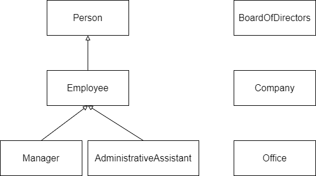
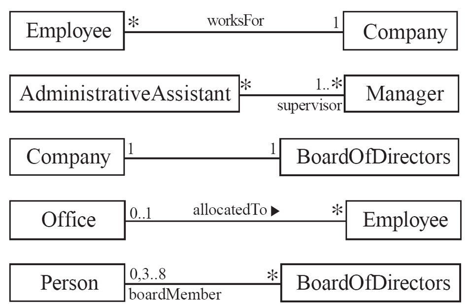

# Object-Oriented Software Engineering hw5

+ Author: 黃柏瑄 (P78081528)

## Environment

+ OS: Ubuntu18.04.5 (WSL2)
+ C++ compiler: g++ (Ubuntu 8.4.0-1ubuntu1~18.04) 8.4.0

## Source code

### Simple UML



### 5 relation



### File architecture
```txt
$ tree . -I 'bin|*.md|Makefile|img'
.
├── administrative_assistant.h
├── board_of_directors.h
├── common.h
├── company.h
├── employee.h
├── manager.h
├── office.h
├── person.h
├── relation1.cc
├── relation2.cc
├── relation3.cc
├── relation4.cc
└── relation5.cc
```

+ File `common.h`
    ```cpp
    #ifndef COMMON_H
    #define COMMON_H
    
    enum class Position {
      Chairman,
      Director,
      Manager,
      ProductManager,
      SeniorEngineer,
      JuniorEngineer,
      AdministrativeAssistant,
    };
    
    enum class Gender : unsigned char {
      M,  // male
      F,  // female
      O,  // other
    };
    
    #endif /* COMMON_H */
    ```

+ File `person.h`
    ```cpp
    #ifndef PERSON_H
    #define PERSON_H
    
    #include <string>
    
    #include "common.h"
    
    class Person {
     public:
      Person(std::string name, Gender gender) : name_{name}, gender_{gender} {}
      std::string get_name() const { return name_; }
      Gender get_gender() const { return gender_; }
      virtual ~Person() = default;
    
     protected:
      std::string name_;
      Gender gender_;
    };
    
    #endif /* PERSON_H */
    ```
    
+ File `employee.h`
    ```cpp
    #ifndef EMPLOYEE_H
    #define EMPLOYEE_H
    
    #include <string>
    
    #include "common.h"
    #include "person.h"
    
    class Company;
    class Office;
    
    class Employee : public Person {
     public:
      Employee(std::string name, Gender gender, int id, Position position)
          : Person{name, gender}, id_{id}, position_{position} {}
      int get_id() const { return id_; }
      Position get_position() const { return position_; }
      void set_workfor(Company *c) { workfor_ = c; }
      const Company *get_workfor() const { return workfor_; }
      void set_office(Office *o) { office = o; }
      const Office *get_office() const { return office; }
      virtual ~Employee() = default;
    
     protected:
      int id_;
      Position position_;
      const Company *workfor_{nullptr};
      const Office *office{nullptr};
    };
    
    #endif /* EMPLOYEE_H */
    ```
    
+ File `manager.h`
    ```cpp
    #ifndef MANAGER_H
    #define MANAGER_H
    
    #include <string>
    #include <vector>
    
    #include "common.h"
    #include "employee.h"
    
    class AdministrativeAssistant;
    
    class Manager : public Employee {
     public:
      Manager(std::string name, Gender gender, int id)
          : Employee{name, gender, id, Position::Manager} {}
      void AddSubordinate(AdministrativeAssistant* a) {
        subordinates_.emplace_back(a);
      }
      std::vector<const AdministrativeAssistant*> get_subordinates() const {
        return subordinates_;
      }
    
     private:
      std::vector<const AdministrativeAssistant*> subordinates_{};
    };
    
    #endif /* MANAGER_H */
    ```
    
+ File `administrative_assistant.h`
    ```cpp
    #ifndef ADMINISTRATIVE_ASSISTANT_H
    #define ADMINISTRATIVE_ASSISTANT_H
    
    #include <string>
    #include <vector>
    
    #include "common.h"
    #include "employee.h"
    #include "manager.h"
    
    class Manager;
    
    class AdministrativeAssistant : public Employee {
     public:
      AdministrativeAssistant(std::string name, Gender gender, int id,
                              Manager* supervisor)
          : Employee{name, gender, id, Position::AdministrativeAssistant},
            supervisors_{supervisor} {
        supervisor->AddSubordinate(this);
      }
      void AddSupervisor(Manager* supervisor) {
        supervisors_.emplace_back(supervisor);
        supervisor->AddSubordinate(this);
      }
      std::vector<const Manager*> get_supervisors() const { return supervisors_; }
    
     private:
      std::vector<const Manager*> supervisors_;
    };
    
    #endif /* ADMINISTRATIVE_ASSISTANT_H */
    ```
    
+ File `board_of_directors.h`
    ```cpp
    #ifndef BOARD_OF_DIRECTORS_H
    #define BOARD_OF_DIRECTORS_H
    
    #include <iostream>
    #include <vector>
    #include "common.h"
    #include "person.h"
    
    class Company;
    
    class BoardOfDirectors {
     public:
      BoardOfDirectors() {}
      BoardOfDirectors(std::vector<const Person*>& p) {
        if (p.size() > 8 || p.size() < 3) {
          std::cerr << "[ERROR] The number of member should be in range 3 to 8.\n";
          return;
        }
        board_member_ = p;
      }
      void set_company(const Company* c) { company_ = c; }
      const Company* get_company() { return company_; }
      std::size_t get_num_of_board() const { return board_member_.size(); }
    
     private:
      std::vector<const Person*> board_member_{};
      const Company* company_{nullptr};
    };
    
    #endif /* BOARD_OF_DIRECTORS_H */
    
    ```
    
+ File `company.h`
    ```cpp
    #ifndef COMPANY_H
    #define COMPANY_H
    
    #include <string>
    #include <vector>
    
    #include "board_of_directors.h"
    #include "common.h"
    #include "employee.h"
    
    class BoardOfDirectors;
    
    class Company {
     public:
      Company(std::string name, std::string unified_business_number)
          : name_{name}, unified_business_number_{unified_business_number} {}
      std::string get_name() const { return name_; }
      std::string get_unified_business_number() const {
        return unified_business_number_;
      }
      void AddEmployee(Employee *e) {
        employees_.emplace_back(e);
        e->set_workfor(this);
      }
      std::size_t get_num_of_employees() const { return employees_.size(); }
      void set_board_of_directors(BoardOfDirectors *b) {
        b->set_company(this);
        board_of_directors_ = b;
      }
      const BoardOfDirectors *get_board_of_directors() {
        return board_of_directors_;
      }
    
      std::vector<const Employee *> Filter(std::string name) {
        std::vector<const Employee *> ret;
        for (const Employee *e : employees_)
          if (e->get_name() == name) ret.emplace_back(e);
        return ret;
      }
    
      std::vector<const Employee *> Filter(int id) {
        std::vector<const Employee *> ret;
        for (const Employee *e : employees_)
          if (e->get_id() == id) ret.emplace_back(e);
        return ret;
      }
    
      std::vector<const Employee *> Filter(Gender gender) {
        std::vector<const Employee *> ret;
        for (const Employee *e : employees_)
          if (e->get_gender() == gender) ret.emplace_back(e);
        return ret;
      }
    
      std::vector<const Employee *> Filter(Position position) {
        std::vector<const Employee *> ret;
        for (const Employee *e : employees_)
          if (e->get_position() == position) ret.emplace_back(e);
        return ret;
      }
    
     private:
      std::string name_;
      std::string unified_business_number_;
      std::vector<const Employee *> employees_{};
      const BoardOfDirectors *board_of_directors_{nullptr};
    };
    
    #endif /* COMPANY_H */
    ```
    
+ File `office.h`
    ```cpp
    #ifndef OFFICE_H
    #define OFFICE_H
    
    #include <vector>
    
    #include "common.h"
    #include "employee.h"
    
    class Office {
     public:
      Office(std::string name) : name_{name} {}
      std::string get_name() const { return name_; }
      void AddEmployee(Employee* e) {
        allocated_to_.emplace_back(e);
        e->set_office(this);
      }
    
     private:
      std::string name_;
      std::vector<const Employee*> allocated_to_{};
    };
    
    #endif
    ```
    
+ File `relation1.cc`
    ```cpp
    #include <iostream>
    #include <vector>
    
    #include "common.h"
    #include "company.h"
    #include "employee.h"
    
    int main() {
      /* New Company */
      auto apple = new Company("Apple", "0123456789");
    
      /* New employees */
      auto alice = new Employee("Alice", Gender::F, 0, Position::Chairman);
      auto bob = new Employee("Bob", Gender::M, 1, Position::SeniorEngineer);
      auto carol = new Employee("Carol", Gender::M, 2, Position::ProductManager);
      auto dave = new Employee("Dave", Gender::M, 3, Position::JuniorEngineer);
      auto eve = new Employee("Eve", Gender::F, 4, Position::JuniorEngineer);
    
      /* Add relation */
      apple->AddEmployee(alice);
      apple->AddEmployee(bob);
      apple->AddEmployee(carol);
      apple->AddEmployee(dave);
      apple->AddEmployee(eve);
    
      /* Validation */
      std::cout << "Number of employees in the company, " << apple->get_name()
                << ", is " << apple->get_num_of_employees() << ".\n";
      std::cout << alice->get_name() << " work for "
                << alice->get_workfor()->get_name() << ".\n";
    
      /* Filter function */
      std::cout << "Filter id where position is \"Junior Engineer\":\n";
      auto filter = apple->Filter(Position::JuniorEngineer);
      for (const auto e : filter) {
        std::cout << e->get_id() << " ";
      }
      std::cout << "\n";
    
      std::cout << "Filter name where gender is \"M\":\n";
      auto filter_gender = apple->Filter(Gender::M);
      for (const auto e : filter_gender) {
        std::cout << e->get_name() << " ";
      }
      std::cout << "\n";
    
      /* Release allocated resources */
      for (auto &p : {alice, bob, carol, dave, eve}) delete p;
      delete apple;
      return 0;
    }
    ```
    
+ File `relation2.cc`
    ```cpp
    #include <iostream>
    #include <vector>
    
    #include "administrative_assistant.h"
    #include "common.h"
    #include "manager.h"
    
    int main() {
      Employee* alice = new Manager("Alice", Gender::F, 0);
      Employee* bob = new Manager("Bob", Gender::M, 0);
      Employee* carol = new Manager("Carol", Gender::M, 0);
      Employee* dave = new Manager("Dave", Gender::M, 0);
    
      /* Each administrative assistant should have at least one manager as
       * the supervisor */
      Employee* eve = new AdministrativeAssistant("Eve", Gender::F, 0,
                                                  dynamic_cast<Manager*>(alice));
      Employee* isaac = new AdministrativeAssistant("Isaac", Gender::M, 0,
                                                    dynamic_cast<Manager*>(carol));
      Employee* justin = new AdministrativeAssistant("Justin", Gender::M, 0,
                                                     dynamic_cast<Manager*>(alice));
    
      /* Assign more manager as the supervisor */
      dynamic_cast<AdministrativeAssistant*>(eve)->AddSupervisor(
          dynamic_cast<Manager*>(bob));
      dynamic_cast<AdministrativeAssistant*>(eve)->AddSupervisor(
          dynamic_cast<Manager*>(dave));
    
      /* Validation */
      std::cout << "The supervisors of " << eve->get_name() << ":\n";
      for (const auto i :
           dynamic_cast<AdministrativeAssistant*>(eve)->get_supervisors()) {
        std::cout << i->get_name() << " ";
      }
      std::cout << "\n";
    
      std::cout << "The subordinates of " << alice->get_name() << ":\n";
      for (const auto i : dynamic_cast<Manager*>(alice)->get_subordinates()) {
        std::cout << i->get_name() << " ";
      }
      std::cout << "\n";
    
      /* Release allocated resources */
      for (auto& p : {alice, bob, carol, dave, eve, isaac, justin}) delete p;
      return 0;
    }
    ```
    
+ File `relation3.cc`
    ```cpp
    #include <iostream>
    #include <vector>
    
    #include "board_of_directors.h"
    #include "common.h"
    #include "company.h"
    
    int main() {
      auto apple = new Company("Apple", "0123456789");
      auto board_of_apple = new BoardOfDirectors();
      apple->set_board_of_directors(board_of_apple);
    
      std::cout << "The company of the board: ";
      std::cout << board_of_apple->get_company()->get_name() << "\n";
      std::cout << "The number of board members of Apple company: ";
      std::cout << apple->get_board_of_directors()->get_num_of_board() << "\n";
    
      /* Release allocated resources */
      delete apple;
      delete board_of_apple;
      return 0;
    }
    ```
    
+ File `relation4.cc`
    ```cpp
    #include <iostream>
    
    #include "employee.h"
    #include "office.h"
    
    int main() {
      /* New employees */
      auto alice = new Employee("Alice", Gender::F, 0, Position::Chairman);
      auto bob = new Employee("Bob", Gender::M, 1, Position::SeniorEngineer);
      auto carol = new Employee("Carol", Gender::M, 2, Position::ProductManager);
      auto dave = new Employee("Dave", Gender::M, 3, Position::JuniorEngineer);
      auto eve = new Employee("Eve", Gender::F, 4, Position::JuniorEngineer);
    
      auto office = new Office("room1");
      office->AddEmployee(bob);
      office->AddEmployee(carol);
      office->AddEmployee(dave);
    
      for (auto &e : {alice, bob, carol, dave, eve}) {
        if (e->get_office() != nullptr)
          std::cout << e->get_name() << " is in " << e->get_office()->get_name()
                    << ".\n";
        else
          std::cout << e->get_name() << " not in any office.\n";
        delete e;
      }
      delete office;
      return 0;
    }
    ```
    
+ File `relation5.cc`
    ```cpp
    #include <vector>
    
    #include "board_of_directors.h"
    #include "common.h"
    #include "person.h"
    
    int main() {
      std::vector<const Person*> v1;
      v1.push_back(new Person("p0", Gender::F));
      v1.push_back(new Person("p1", Gender::F));
      v1.push_back(new Person("p2", Gender::M));
      v1.push_back(new Person("p3", Gender::M));
      v1.push_back(new Person("p4", Gender::F));
    
      auto board1 = new BoardOfDirectors(v1);
      std::cout << "The number of member: " << board1->get_num_of_board() << "\n";
    
      std::vector<const Person*> v2;
      v2.push_back(new Person("r0", Gender::F));
      v2.push_back(new Person("r1", Gender::F));
    
      auto board2 = new BoardOfDirectors(v2);
      std::cout << "The number of member: " << board2->get_num_of_board() << "\n";
    
      /* Release allocated resources */
      for (auto& p : v1) delete p;
      for (auto& p : v2) delete p;
      for (auto& p : {board1, board2}) delete p;
    }
    ```

## Executive results

+ relation1:
    ```txt
    $ ./bin/relation1
    Number of employees in the company, Apple, is 5.
    Alice work for Apple.
    Filter id where position is "Junior Engineer":
    3 4 
    Filter name where gender is "M":
    Bob Carol Dave
    ```
    
+ relation2:
    ```txt
    $ ./bin/relation2
    The supervisors of Eve:
    Alice Bob Dave 
    The subordinates of Alice:
    Eve Justin
    ```
    
+ relation3:
    ```txt
    $ ./bin/relation3
    The company of the board: Apple
The number of board members of Apple company: 0
    ```
    
+ relation4:
    ```txt
    $ ./bin/relation4
    Alice not in any office.
    Bob is in room1.
    Carol is in room1.
    Dave is in room1.
    Eve not in any office.
    ```
    
+ relation5:
    ```txt
    $ ./bin/relation5
    The number of member: 5
    [ERROR] The number of member should be in range 3 to 8.
    The number of member: 0
    ```